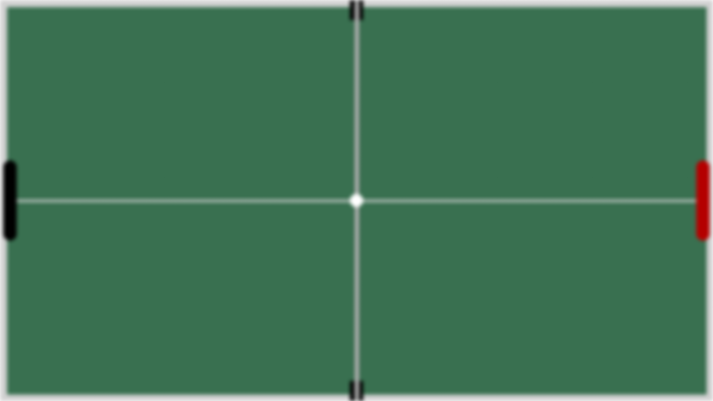

<div align="center">
  <h1>
    Table Tennis
  </h1>
</div>

***To anyone who might be reading this code:***

*This is a Python-based Table Tennis game built with Pygame. While the game is functional and enjoyable, 
I acknowledge that there are areas for improvement in the code structure and organization. 
Your understanding and feedback are appreciated.*

## Screenshots
### Main Menu


### In-Game


## Features
- **Resolution-Aware Design**: Automatically adapts to different screen resolutions (4K, 1080p, 720p)
- **Progressive Difficulty**: Ball speed increases gradually as the score progresses
- **Realistic Physics**: Ball angle changes based on where it hits the paddle
- **Score Tracking**: Keeps track of both individual game scores and match wins
- **Responsive Controls**: Smooth paddle movement with keyboard controls

## Installation

### Requirements
- Python 3.x
- Pygame
- Git

```bash
# Clone the repository
git clone https://github.com/your-username/Table-Tennis.git

# Navigate to the project directory
cd Table-Tennis

# Run the game
python src/main.py
```

## How to Play:
- **Left Player Controls**:
  - W: Move paddle up
  - S: Move paddle down
- **Right Player Controls**:
  - ↑: Move paddle up
  - ↓: Move paddle down
- **Game Rules**:
  - First player to reach 10 points wins the game
  - Ball speed increases gradually as the score progresses
  - Ball angle changes based on where it hits the paddle
  - First player to win 3 games wins the match

## Development
- **Technologies Used**:
    - Python
    - Pygame
    - Object-Oriented Programming principles

## Project Structure
```
Table-Tennis/
├── src/
│   ├── assets/
│   │   ├── images/
│   │   │   ├── main_menu/
│   │   │   └── paddles/
│   │   └── fonts/
│   └── scripts/
│       ├── buttons.py
│       ├── constants.py
│       ├── display_resolution.py
│       ├── entities.py
│       ├── main_menu_rendering.py
│       ├── scores_rendering.py
│       └── table_rendering.py
└── main.py
```

## Credits
- **Developer**: [Your Name](https://github.com/your-username)
- **Special Thanks**: 
  - Pygame Community for the excellent documentation and resources
  - The open-source community for inspiration and support

## License
This project is licensed under the MIT License - see the [LICENSE](LICENSE) file for details.
