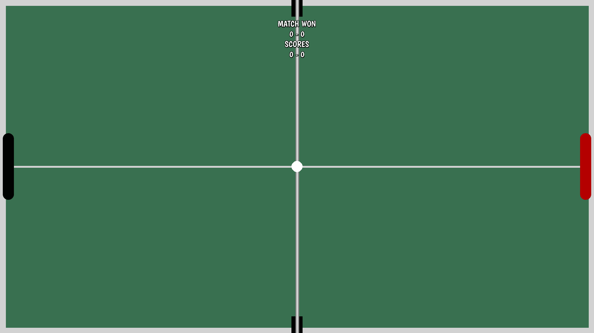

<div align="center">
  <h1>
    Table Tennis
  </h1>
</div>

**Table Tennis** is a high resolution Pong clone built with Pygame. You can play against a friend, with smooth controls, scalable graphics, and dynamic gameplay. The game also supports multiple screen resolutions.

## Screenshots
### Main Menu


### In-Game



## Installation
### Requirements
- Python 3.12 or higher
- Git
- Pip


### Clone the repository
```bash 
git clone https://github.com/ernest-mm/Table-Tennis.git
```
or with SSH if you have it configured

### Navigate to the project directory
```bash
cd Table-Tennis
```

### Install the requirements
```bash
pip install -r requirements.txt
```

## Running the game
```bash
python src/main.py
```

## How to Play:
- **Left Player Controls**:
  - W: Move paddle up
  - S: Move paddle down
- **Right Player Controls**:
  - ↑: Move paddle up
  - ↓: Move paddle down
- **Game Rules**:
  - First player to reach 10 points wins the game
  - Ball speed increases gradually as the score progresses
  - Ball angle changes based on where it hits the paddle

## Development
- **Technologies Used**:
    - Python 3.12.9
    - Pygame-ce 2.5.2

## Optional Future Improvements
- Add single-player mode with AI opponent
- Sound effects and background music
- Enhanced animations and particle effects
- In-game settings menu

## Credits
- **Developer**: [Ernest M.](https://github.com/ernest-mm)
- **Special Thanks**: 
  - Pygame Community for the excellent documentation and resources

## License
This project is licensed under the MIT License - see the [LICENSE](LICENSE) file for details.
